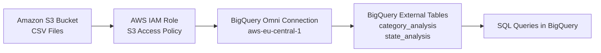

# AWS S3 + BigQuery Omni Integration Demo

This project demonstrates how to connect Amazon S3 to Google BigQuery Omni and run federated SQL queries directly on data stored in AWS S3.

---

# Project Overview

In this demo project:

* Created an Amazon S3 bucket
* Uploaded CSV datasets to S3
* Configured AWS IAM roles and trust policies
* Connected Amazon S3 to BigQuery Omni
* Created external tables in BigQuery
* Queried S3 data directly using SQL

This project demonstrates a simple cross-cloud analytics workflow using AWS and Google Cloud Platform.

---

# Technologies Used

* Amazon S3
* AWS IAM
* Google BigQuery Omni
* SQL
* Google Cloud Platform (GCP)

---

# Architecture

AWS S3 stores the datasets, while BigQuery Omni accesses and queries the data without moving it into Google Cloud Storage.


---

# Sample Queries

## Category Analysis

```sql
SELECT *
FROM `aws-s3-bigquery-analysis.aws_dataset.category_analysis`
LIMIT 10;
```

## State Analysis

```sql
SELECT *
FROM `aws-s3-bigquery-analysis.aws_dataset.state_analysis`
LIMIT 10;
```

---

# Key Learnings

* Cross-cloud analytics architecture
* Federated querying with BigQuery Omni
* AWS IAM role configuration
* Secure S3 access from GCP
* External table creation in BigQuery

---

# Screenshots

## BigQuery Omni Connection


## External Table Schema


## Query Results


---

# Author

Built as a hands-on cloud and data engineering practice project.
